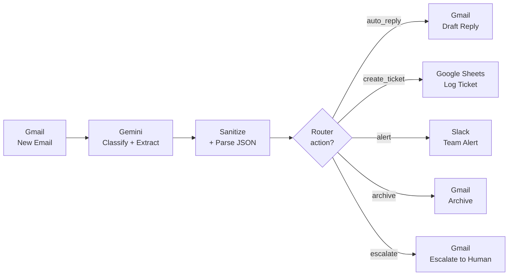
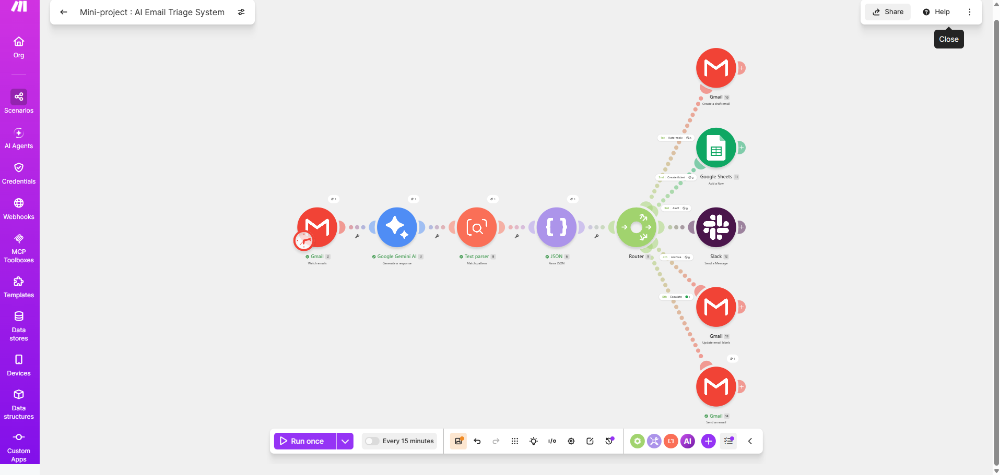
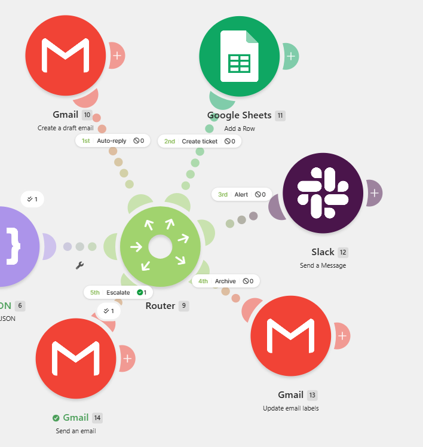
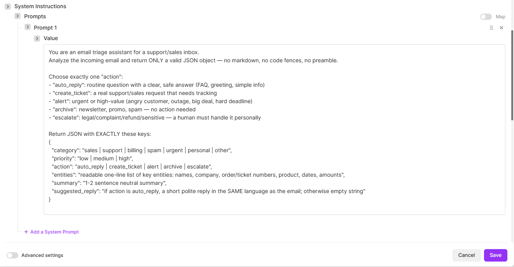
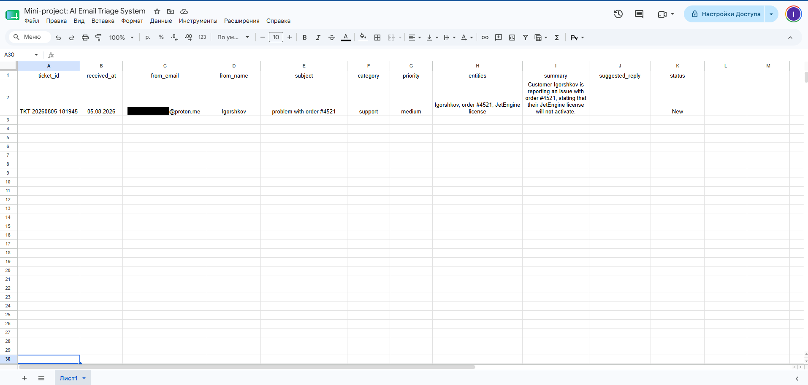
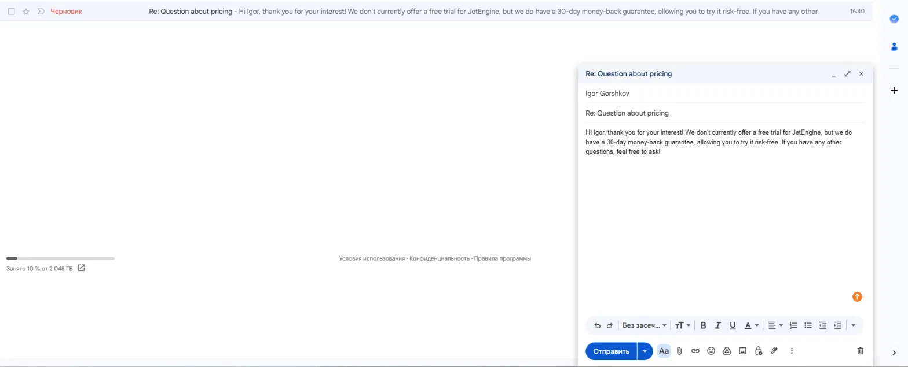
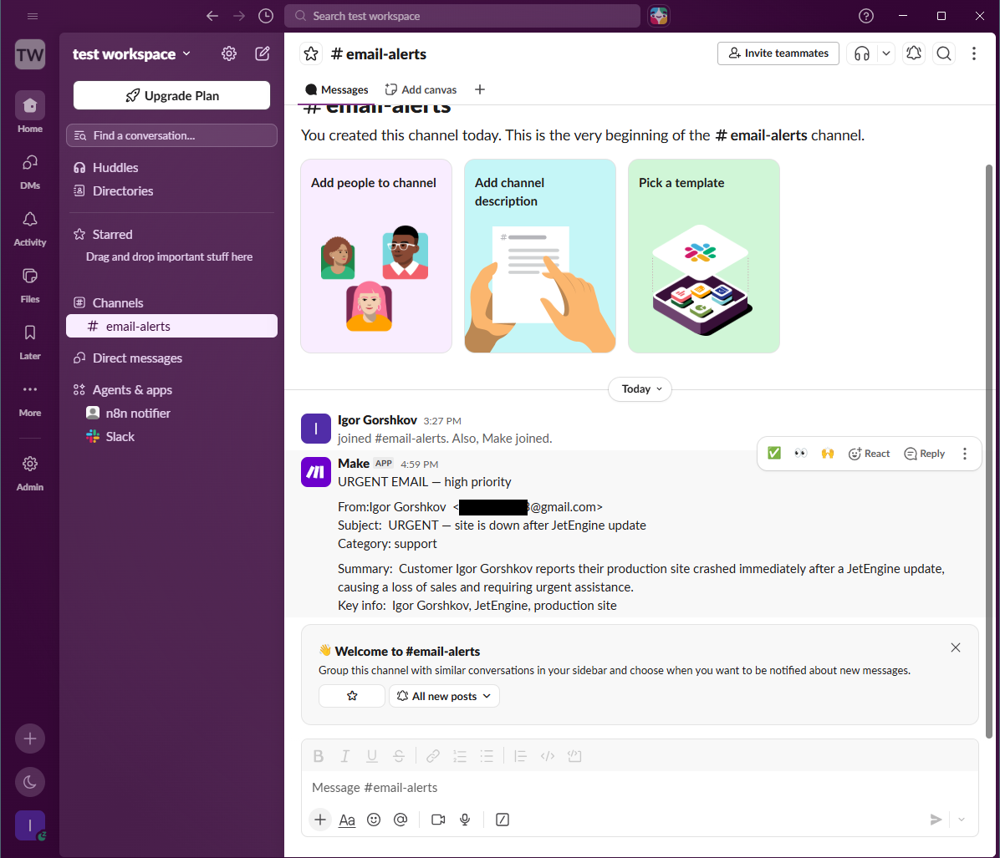
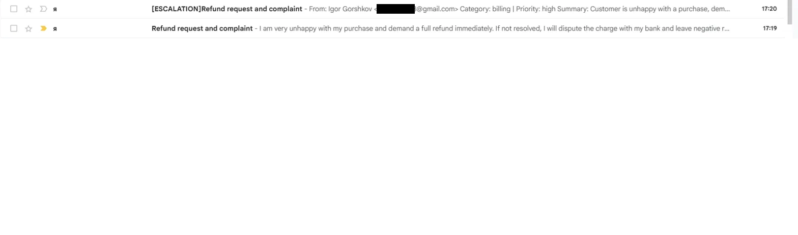

# AI Email Triage System

> An end-to-end automation that reads every incoming email with **Google Gemini**, classifies it, extracts key entities, and routes it to one of **five actions** — auto-reply, ticket, alert, archive, or human escalation. Built in **Make.com**, no manual sorting required.

<!-- Optional: replace with your Loom link once recorded -->
🎥 **[Watch the 90-second demo on Loom](#)**

---

## Overview

Support and sales inboxes are noisy: routine FAQs, real tickets, urgent outages, newsletters, and sensitive complaints all land in the same place. This project automates the **first-response layer** — every email is analyzed by an LLM and routed to the right action the moment it arrives.

The result: routine questions get an AI-drafted reply, real requests become structured tickets, urgent issues ping the team instantly, noise is archived, and anything sensitive is escalated to a human — automatically.

---

## Architecture





---

## How it works

1. **Trigger — Gmail (Watch Emails).** Fires on each new email and passes sender, subject, and body downstream.
2. **Classify & extract — Google Gemini (`gemini-2.5-flash`).** A single prompt turns the raw email into structured JSON: category, priority, chosen action, extracted entities, a short summary, and a draft reply.
3. **Sanitize & parse.** A regex extraction step pulls the JSON object out of the model's raw output (resilient to markdown code fences), then Parse JSON exposes each field for routing.
4. **Route — Router.** A single filter per branch on the `action` field sends the email down exactly one of five paths.
5. **Act.** Each branch performs a real-world action in Gmail, Google Sheets, or Slack.

---

## Routing logic

| Action | When | What happens |
|---|---|---|
| `auto_reply` | Routine question with a safe, clear answer (FAQ, pricing, greeting) | Gemini writes a reply → saved as a **Gmail draft** for human review |
| `create_ticket` | A real support/sales request that needs tracking | A structured row is appended to **Google Sheets** (ID, sender, category, entities, summary, status) |
| `alert` | Urgent / high-value (outage, angry customer, hard deadline) | An instant **Slack** message is posted to `#email-alerts` |
| `archive` | Newsletter, promo, or spam | Email is **archived** in Gmail (INBOX label removed) |
| `escalate` | Legal, refund, complaint, or sensitive | Email is forwarded to a **human** with full AI-generated context |



---

## The classification prompt

The "brain" is a single system prompt instructing Gemini to return **only** valid JSON:

```
You are an email triage assistant for a support/sales inbox.
Analyze the incoming email and return ONLY a valid JSON object.

Choose exactly one "action":
- "auto_reply": routine question with a clear, safe answer
- "create_ticket": a real support/sales request that needs tracking
- "alert": urgent or high-value (angry customer, outage, big deal, hard deadline)
- "archive": newsletter, promo, spam — no action needed
- "escalate": legal/complaint/refund/sensitive — a human must handle it

Return JSON with EXACTLY these keys:
{
  "category": "sales | support | billing | spam | urgent | personal | other",
  "priority": "low | medium | high",
  "action": "auto_reply | create_ticket | alert | archive | escalate",
  "entities": "key entities: names, company, order/ticket numbers, product, dates, amounts",
  "summary": "1-2 sentence neutral summary",
  "suggested_reply": "if auto_reply, a short polite reply in the same language; else empty"
}
```



---

## Tech stack

- **Make.com** — orchestration, routing, error handling
- **Google Gemini** (`gemini-2.5-flash`) — classification & entity extraction
- **Gmail API** — trigger, drafts, archiving, escalation
- **Google Sheets** — lightweight ticket store
- **Slack** — real-time team alerts

---

## Engineering decisions & challenges

**Robust JSON extraction (LLM output sanitizing).** LLMs don't always respect output-format instructions — Gemini intermittently wrapped its JSON in markdown code fences (` ```json … ``` `), which broke the parser. Instead of relying on the prompt alone, I added a regex extraction step that pulls the JSON object from the raw output regardless of surrounding formatting. The pipeline is now resilient to formatting drift.

**Human-in-the-loop for customer replies.** Auto-replies are saved as **Gmail drafts**, never sent automatically. A human reviews tone and facts, then sends with one click. This is a deliberate safety boundary — an LLM should not reply to customers unsupervised.

**Structured output over free text.** The model returns a strict JSON schema rather than prose. This makes routing deterministic (a single equality filter per branch) and keeps every downstream module simple and debuggable.

**Provider-agnostic by design.** Because the LLM step only needs to return the agreed JSON schema, swapping Gemini for OpenAI (or any other model) is a one-module change — nothing downstream is affected.

---

## Screenshots

| Ticket logged to Sheets | AI-drafted reply |
|---|---|
|  |  |

| Slack alert | Human escalation |
|---|---|
|  |  |

---

## Run it yourself

1. Download 'blueprint/ai-email-triage.blueprint.json'.
2. In Make.com: **Create a new scenario → ⋯ menu → Import Blueprint** and select the file.
3. Reconnect the four connections (Gmail, Google Gemini, Google Sheets, Slack) with your own accounts.
4. Point the Google Sheets module at a sheet with the header row:
   `ticket_id | received_at | from_email | from_name | subject | category | priority | entities | summary | suggested_reply | status`
5. Set the Slack module to your alert channel, then run.

---

## Possible improvements

- **Error handler with HTTP fallback** to the Gemini API for resilience against rate limits.
- **Confidence-based routing** — send low-confidence classifications to a human review queue.
- **Thread awareness / deduplication** so replies to existing tickets don't create duplicates.
- **Swap the ticket store** from Google Sheets to a real database, Notion, or a ticketing system (Jira, Trello).
- **Sentiment scoring** to prioritize frustrated customers within the alert branch.

---

## Author

**Igor Gorshkov** — Support Engineer moving into AI Automation.
Built as part of an AI automation portfolio.
