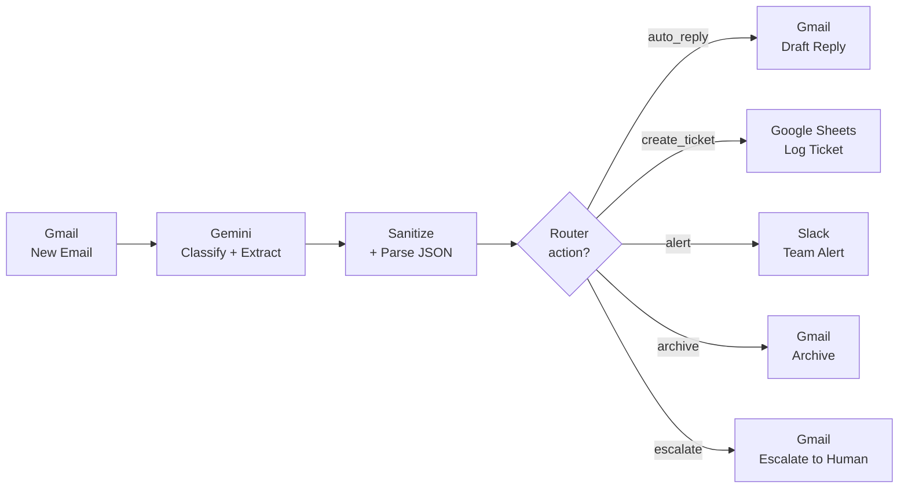

<!-- Language switcher -->
[English](README.md) · [Українська](README.uk.md) · **Русский**

# Система AI-триажа электронной почты

> Сквозная автоматизация, которая читает каждое входящее письмо с помощью **Google Gemini**, классифицирует его, извлекает ключевые теги и по ним направляет к одному из **пяти действий** — автоответ, создание тикета, оповещение, архивация или эскалация к живому агенту поддержки. Собрано в **Make.com**, без ручной сортировки.

🎥 **[Посмотреть 60-секундное демо на Loom](https://www.loom.com/share/3d7bd83c10c04c3993769b51de7cc71f)**

---

## Целеполагание

Электронная почта службы поддержки и продаж завалена рутинными вопросами, реальными тикетами, срочными сбоями, рассылками и чувствительными жалобами — всё попадает в одно место. Этот проект автоматизирует **уровень первого ответа** — каждое письмо анализируется LLM и направляется к нужному действию сразу после поступления, чтобы сократить количество времени на обработку.

Результат: на рутинные вопросы создаётся черновик ответа от AI, реальные запросы становятся структурированными тикетами, срочные проблемы мгновенно оповещают команду, спам сообщения архивируются, а всё чувствительное эскалируется к человеку — автоматически.

---

## Архитектура




---

## Как это работает

1. **Триггер — Gmail (Watch Emails).** Срабатывает на каждое новое письмо и передаёт отправителя, тему и тело дальше по цепочке.
2. **Классификация и извлечение — Google Gemini (`gemini-2.5-flash`).** Один промпт превращает сырое письмо в структурированный JSON: категория, приоритет, выбранное действие, извлечённые теги, краткое резюме и черновик ответа.
3. **Санитизация и парсинг.** Шаг с регулярным выражением извлекает JSON-объект из сырого вывода модели (устойчив к markdown-ограждению), после чего Parse JSON раскладывает каждое поле для маршрутизации.
4. **Маршрутизация — Router.** Один фильтр на каждую ветку по полю `action` направляет письмо ровно одним из пяти путей.
5. **Действие.** Каждая ветка выполняет реальное действие в Gmail, Google Sheets или Slack.

---

## Логика маршрутизации

| Действие | Когда | Что происходит |
|---|---|---|
| `auto_reply` | Рутинный вопрос с безопасным, чётким ответом (FAQ, цены, приветствие) | Gemini пишет ответ → сохраняется как **черновик Gmail** для проверки человеком |
| `create_ticket` | Реальный запрос поддержки/продаж, требующий отслеживания | Структурированная строка добавляется в **Google Sheets** (ID, отправитель, категория, сущности, резюме, статус) |
| `alert` | Срочный / высокоценный (сбой, разгневанный клиент, жёсткий дедлайн) | Мгновенное сообщение в **Slack** в канал `#email-alerts` |
| `archive` | Рассылка, промо или спам | Письмо **архивируется** в Gmail (метка INBOX снята) |
| `escalate` | Юридическое, возврат средств, жалоба или чувствительное | Письмо пересылается **человеку** с полным контекстом, сгенерированным AI |


---

## Промпт классификации

«Мозг» — это один системный промпт, инструктирующий Gemini возвращать **только** валидный JSON:

```
You are an email triage assistant for a support/sales inbox.
Analyze the incoming email and return ONLY a valid JSON object.

Choose exactly one "action":
- "auto_reply": routine question with a clear, safe answer
- "create_ticket": a real support/sales request that needs tracking
- "alert": urgent or high-value (angry customer, outage, big deal, hard deadline)
- "archive": newsletter, promo, spam — no action needed
- "escalate": legal/complaint/refund/sensitive — a human must handle it

Return JSON with EXACTLY these keys:
{
  "category": "sales | support | billing | spam | urgent | personal | other",
  "priority": "low | medium | high",
  "action": "auto_reply | create_ticket | alert | archive | escalate",
  "entities": "key entities: names, company, order/ticket numbers, product, dates, amounts",
  "summary": "1-2 sentence neutral summary",
  "suggested_reply": "if auto_reply, a short polite reply in the same language; else empty"
}
```


---

## Технологический стек

- **Make.com** — оркестрация, маршрутизация, обработка ошибок
- **Google Gemini** (`gemini-2.5-flash`) — классификация и извлечение сущностей
- **Gmail API** — триггер, черновики, архивация, эскалация
- **Google Sheets** — лёгкое хранилище тикетов
- **Slack** — оповещения команды в реальном времени

---

## Инженерные решения и вызовы

**Надёжное извлечение JSON (санитизация вывода LLM).** LLM не всегда соблюдают инструкции по формату вывода — Gemini периодически оборачивал свой JSON в markdown-ограждение (` ```json … ``` `), что ломало парсер. Вместо того чтобы полагаться только на промпт, я добавил шаг извлечения через text parser - match pattern (?<json>\{[\s\S]*\}), который достаёт JSON-объект из сырого вывода независимо от окружающего форматирования. 

**Human-in-the-loop для ответов клиентам.** Автоответы сохраняются как **черновики Gmail** и никогда не отправляются автоматически. Человек проверяет тон и факты, затем отправляет одним кликом. Это осознанная граница безопасности — LLM не должен отвечать клиентам без надзора.

**Структурированный вывод вместо свободного текста.** Модель возвращает строгую JSON-схему, а не прозу. Это делает маршрутизацию детерминированной (один фильтр равенства на ветку) и держит каждый последующий модуль простым и удобным для отладки.

**Независимость от провайдера по замыслу.** Поскольку шагу LLM нужно лишь вернуть согласованную JSON-схему, замена Gemini на OpenAI (или любую другую модель) — это изменение одного модуля, ничего дальше по цепочке не затрагивается.

---

## Скриншоты

| Тикет в Google Sheets | Черновик ответа от AI |
|---|---|
|  |  |

| Оповещение в Slack | Эскалация к человеку |
|---|---|
|  |  |

---

## Запустить самостоятельно

1. Скачайте [Make.com blueprint](blueprint/ai-email-triage.blueprint.json).
2. В Make.com: **Create a new scenario → меню ⋯ → Import Blueprint** и выберите файл.
3. Переподключите четыре соединения (Gmail, Google Gemini, Google Sheets, Slack) со своими аккаунтами.
4. Направьте модуль Google Sheets на таблицу со строкой заголовков:
   `ticket_id | received_at | from_email | from_name | subject | category | priority | entities | summary | suggested_reply | status`
5. Укажите в модуле Slack свой канал для оповещений и запустите.

---

## Возможные улучшения

- **Обработчик ошибок с HTTP-фолбэком** к Gemini API для устойчивости против лимитов запросов.
- **Маршрутизация по уверенности** — отправлять классификации с низкой уверенностью в очередь проверки человеком.
- **Учёт цепочек / дедупликация**, чтобы ответы на существующие тикеты не создавали дубликаты.
- **Заменить хранилище тикетов** с Google Sheets на настоящую базу данных, Notion или систему тикетов (Jira, Trello).
- **Оценка тональности** для приоритизации разгневанных клиентов в ветке оповещений.

---

## Автор

**Игорь Горшков** — бывший агент поддержки Crocoblock, сейчас перехожу в направление AI-автоматизации.
Создано как часть портфолио по AI-автоматизации.
