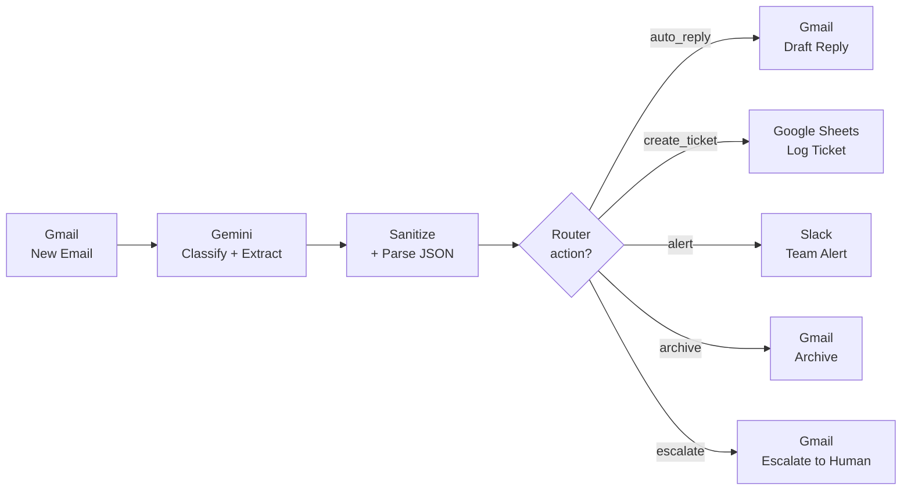

<!-- Language switcher -->
[English](README.md) · **Українська** · [Русский](README.ru.md)

# Система AI-тріажу електронної пошти

> Наскрізна автоматизація, яка читає кожен вхідний лист за допомогою **Google Gemini**, класифікує його, витягує ключові сутності та скеровує до однієї з **п'яти дій** — автовідповідь, тікет, сповіщення, архівування або ескалація до людини. Побудовано в **Make.com**, без ручного сортування.

🎥 **[Переглянути 60-секундне демо на Loom](https://www.loom.com/share/3d7bd83c10c04c3993769b51de7cc71f)**

---

## Огляд

Скриньки підтримки та продажів переповнені: рутинні питання, реальні тікети, термінові збої, розсилки та чутливі скарги — усе потрапляє в одне місце. Цей проєкт автоматизує **рівень першої відповіді** — кожен лист аналізується LLM і скеровується до потрібної дії одразу після надходження.

Результат: на рутинні питання створюється чернетка відповіді від AI, реальні запити стають структурованими тікетами, термінові проблеми миттєво сповіщають команду, шум архівується, а все чутливе ескалюється до людини — автоматично.

---

## Архітектура




---

## Як це працює

1. **Тригер — Gmail (Watch Emails).** Спрацьовує на кожен новий лист і передає відправника, тему та тіло далі по ланцюжку.
2. **Класифікація та витягування — Google Gemini (`gemini-2.5-flash`).** Один промпт перетворює сирий лист на структурований JSON: категорія, пріоритет, обрана дія, витягнуті сутності, короткий підсумок і чернетка відповіді.
3. **Санітизація та парсинг.** Крок із регулярним виразом витягує JSON-об'єкт із сирого виводу моделі (стійкий до markdown-огорожі), після чого Parse JSON розкладає кожне поле для маршрутизації.
4. **Маршрутизація — Router.** Один фільтр на кожну гілку за полем `action` скеровує лист рівно одним із п'яти шляхів.
5. **Дія.** Кожна гілка виконує реальну дію в Gmail, Google Sheets або Slack.

---

## Логіка маршрутизації

| Дія | Коли | Що відбувається |
|---|---|---|
| `auto_reply` | Рутинне питання з безпечною, чіткою відповіддю (FAQ, ціни, привітання) | Gemini пише відповідь → зберігається як **чернетка Gmail** для перевірки людиною |
| `create_ticket` | Реальний запит підтримки/продажів, що потребує відстеження | Структурований рядок додається до **Google Sheets** (ID, відправник, категорія, сутності, підсумок, статус) |
| `alert` | Терміновий / високоцінний (збій, розлючений клієнт, жорсткий дедлайн) | Миттєве повідомлення в **Slack** у канал `#email-alerts` |
| `archive` | Розсилка, промо або спам | Лист **архівується** в Gmail (мітку INBOX знято) |
| `escalate` | Юридичне, повернення коштів, скарга або чутливе | Лист пересилається **людині** з повним контекстом, згенерованим AI |


---

## Промпт класифікації

«Мозок» — це один системний промпт, який інструктує Gemini повертати **лише** валідний JSON:

```
You are an email triage assistant for a support/sales inbox.
Analyze the incoming email and return ONLY a valid JSON object.

Choose exactly one "action":
- "auto_reply": routine question with a clear, safe answer
- "create_ticket": a real support/sales request that needs tracking
- "alert": urgent or high-value (angry customer, outage, big deal, hard deadline)
- "archive": newsletter, promo, spam — no action needed
- "escalate": legal/complaint/refund/sensitive — a human must handle it

Return JSON with EXACTLY these keys:
{
  "category": "sales | support | billing | spam | urgent | personal | other",
  "priority": "low | medium | high",
  "action": "auto_reply | create_ticket | alert | archive | escalate",
  "entities": "key entities: names, company, order/ticket numbers, product, dates, amounts",
  "summary": "1-2 sentence neutral summary",
  "suggested_reply": "if auto_reply, a short polite reply in the same language; else empty"
}
```


---

## Технологічний стек

- **Make.com** — оркестрація, маршрутизація, обробка помилок
- **Google Gemini** (`gemini-2.5-flash`) — класифікація та витягування сутностей
- **Gmail API** — тригер, чернетки, архівування, ескалація
- **Google Sheets** — легке сховище тікетів
- **Slack** — сповіщення команди в реальному часі

---

## Інженерні рішення та виклики

**Надійне витягування JSON (санітизація виводу LLM).** LLM не завжди дотримуються інструкцій щодо формату виводу — Gemini іноді загортав свій JSON у markdown-огорожу (` ```json … ``` `), що ламало парсер. Замість покладатися лише на промпт, я додав крок витягування через регулярний вираз, який дістає JSON-об'єкт із сирого виводу незалежно від оточуючого форматування. Тепер конвеєр стійкий до дрейфу форматування.

**Human-in-the-loop для відповідей клієнтам.** Автовідповіді зберігаються як **чернетки Gmail** і ніколи не надсилаються автоматично. Людина перевіряє тон і факти, після чого надсилає одним кліком. Це свідома межа безпеки — LLM не повинен відповідати клієнтам без нагляду.

**Структурований вивід замість вільного тексту.** Модель повертає строгу JSON-схему, а не прозу. Це робить маршрутизацію детермінованою (один фільтр рівності на гілку) і тримає кожен наступний модуль простим і зручним для налагодження.

**Незалежність від провайдера за задумом.** Оскільки крок LLM має лише повернути узгоджену JSON-схему, заміна Gemini на OpenAI (чи будь-яку іншу модель) — це зміна одного модуля, нічого далі по ланцюжку не зачіпається.

---

## Скриншоти

| Тікет у Google Sheets | Чернетка відповіді від AI |
|---|---|
|  |  |

| Сповіщення в Slack | Ескалація до людини |
|---|---|
|  |  |

---

## Запустити самостійно

1. Завантажте [Make.com blueprint](blueprint/ai-email-triage.blueprint.json).
2. У Make.com: **Create a new scenario → меню ⋯ → Import Blueprint** і оберіть файл.
3. Перепідключіть чотири з'єднання (Gmail, Google Gemini, Google Sheets, Slack) зі своїми обліковими записами.
4. Спрямуйте модуль Google Sheets на таблицю з рядком заголовків:
   `ticket_id | received_at | from_email | from_name | subject | category | priority | entities | summary | suggested_reply | status`
5. Вкажіть у модулі Slack свій канал для сповіщень і запустіть.

---

## Можливі покращення

- **Обробник помилок із HTTP-фолбеком** до Gemini API для стійкості проти лімітів запитів.
- **Маршрутизація за впевненістю** — відправляти класифікації з низькою впевненістю до черги перевірки людиною.
- **Врахування ланцюжків / дедуплікація**, щоб відповіді на наявні тікети не створювали дублікати.
- **Замінити сховище тікетів** із Google Sheets на справжню базу даних, Notion або систему тікетів (Jira, Trello).
- **Оцінка тональності** для пріоритезації розлючених клієнтів у гілці сповіщень.

---

## Автор

**Ігор Горшков** — колишній агент підтримки Crocoblock, зараз переходжу в напрямок AI-автоматизації.
Створено як частина портфоліо з AI-автоматизації.
